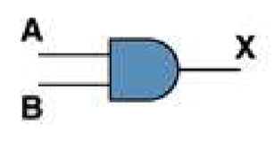
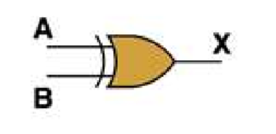
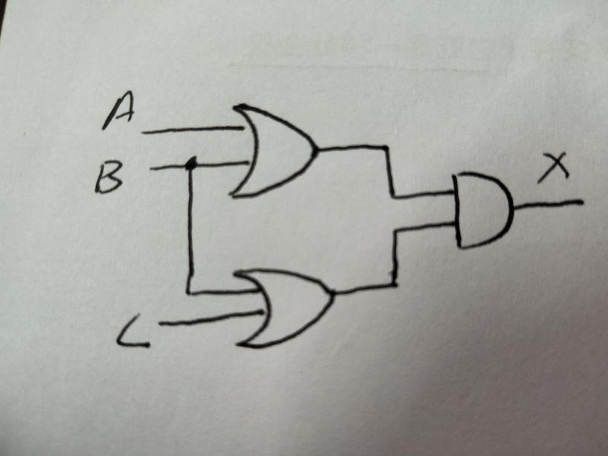
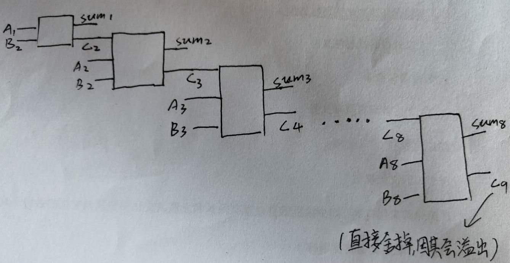

1) Give the three representations of an AND gate and say in your words what AND means. 

Boolean expressions :  A·B  
logic diagrams ：
   
truth tables ：

| A            | B          | O |
|:-------------|:------------------|:------|
| 0           | 0 | 1  |
| 0           | 1   | 0  |
| 1           | 0      | 0  |
| 1         | 1 | 1 |  
2) Give the three representations of an XOR gate and say in your words what XOR means.  
Boolean expressions : (A+B)'  
logic diagrams ：  
     
 truth tables ： 

| A            | B          | O |
|:-------------|:------------------|:------|
| 0           | 0 | 1  |
| 0           | 1   | 0  |
| 1           | 0      | 0  |
| 1         | 1 | 0 |      
3) Draw a circuit diagram corresponding to the following Boolean expression: (A + B)(B + C)   
    
 4)  
   
 | A            | B          | O |
|:-------------|:------------------|:------|
| 0           | 0 | 0  |
| 0           | 1   | 0  |
| 1           | 0      | 1  |
| 1         | 1 | 0 |   
5) What is circuit equivalence? Use truth table to prove the following formula. (AB)’ = A’ + B’    

| A            | B          | (AB)’  | A’ + B’|
|:-------------|:------------------|:------|:-------------|
| 0           | 0 | 1  |1
| 0           | 1   | 1  |1
| 1           | 0      | 1  |1
| 1         | 1 | 0 |0
  
6)   
   

7)   
(1)  (X8X7X6X5X4X3X2X1)2 or (00001111)2 = (X8X7X6X51111)2   
(2)  (X8X7X6X5X4X3X2X1)2 xor (00001111)2 = (X8'X7'X6'X5'1111)2   
(3)  ((X8X7X6X5X4X3X2X1)2 and(11110000)2 ) or  (not (X8X7X6X5X4X3X2X1)2 and (00001111)2)  =  (X8X7X6X5X4'X3'X2'X1')2    
使用维基百科，解释以下概念。 1)Logic gate 2)Boolean algebra  

1)Logic gate  
In electronics, a logic gate is an idealized or physical device implementing a Boolean function; that is, it performs a logical operation on one or more binary inputs and produces a single binary output.   
在电子学中，逻辑门是实现布尔函数的理想化或物理设备；即，它对一个或多个二进制输入执行逻辑操作并产生单个二进制输出。  
2)Boolean algebra  
In mathematics and mathematical logic, Boolean algebra is the branch of algebra in which the values of the variables are the truth values true and false, usually denoted 1 and 0 respectively.  
在数学和数学逻辑中，布尔代数是代数的分支，其中变量的值是真值true和false，通常分别表示1和0。

1)Flip-flop 中文翻译是？  
 2)How many bits information does a SR latch store?  
   1)触发器
   2)4