# 如何用construct2制作简单的小游戏

# 1.下载并安装construct2

    首先我们要下载并安装construt2，Construct 2是一款功能强大的HTML5戏制作软件，专为2D游戏而设计。无论你有无编程基础都可以用该软件制作游戏。
    可点击下方来下载该软件

>[点此下载](https://www.scirra.com/construct2)
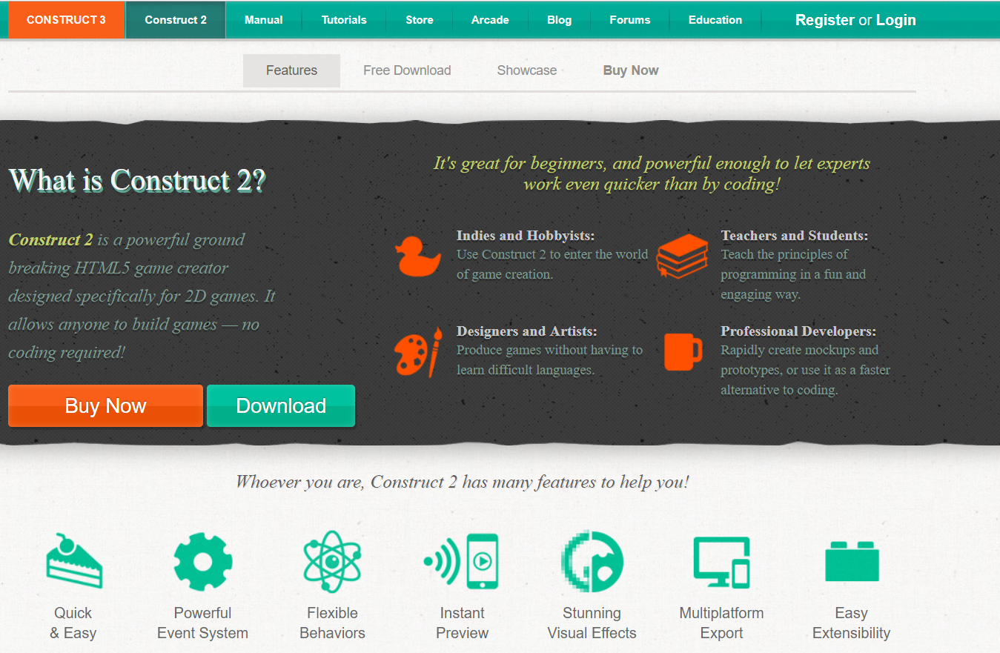

# 2. 开始

    进去construct2后，点击左上角的File按钮，然后选择New。
    随后会有如下弹窗
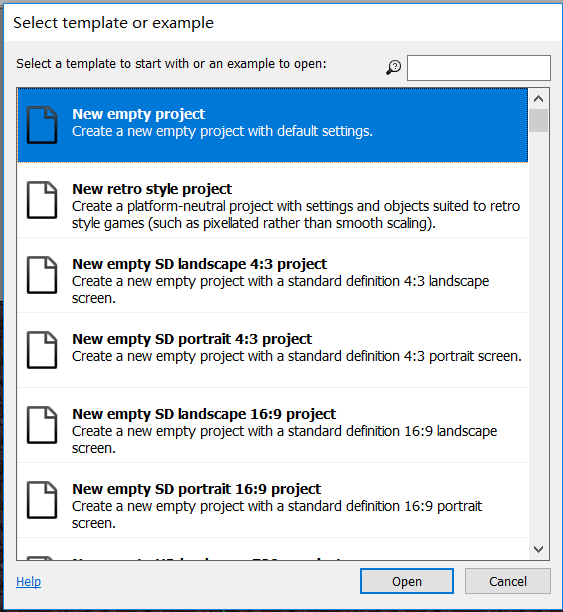

随后点击open即可
# 3. 平铺背景

现在，双击布局中的空白处以插入新对象。出现“ 插入新对象”对话框后，双击“平铺背景”将背景插入。

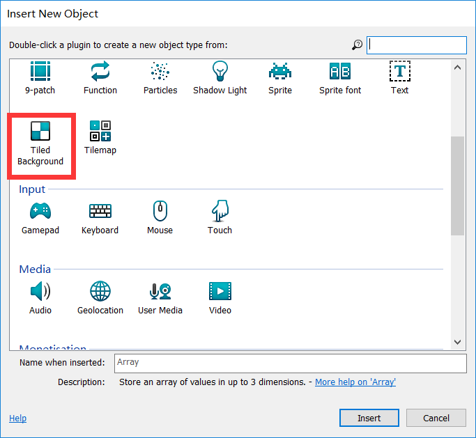

图标变成十字形后，单击空白处即可

点击后，会出现下图的界面，点击绿色框框圈出的按钮，然后选择自己喜欢的一张图片作为背景，这样就初步完成了背景的平铺。

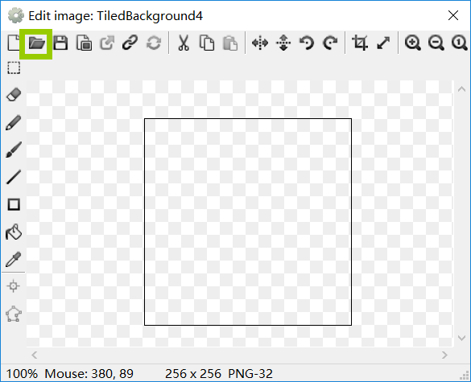

平铺背景以后可以对背景进行适当的编辑

通过左边的一栏可以编辑背景

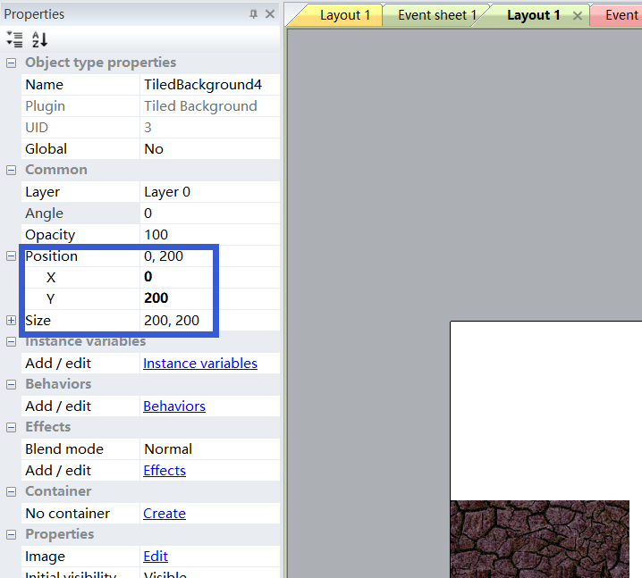

position可以调整图片的位置，这里要注意的是，这里的x轴和y轴和我们数学中常见的xy轴有所不同，在这张图上原点是位于图的左上角的，x轴是向右延伸的，y轴是向下延伸的。（若xy均为0的话，图片会位于左上角）

size顾名思义是用来调整图片的大小的

# 4. 添加游戏对象

在插入游戏形象之前，我们要添加一个图层，添加图层是为了让我们的游戏对象改在背景上,具体操作为在屏幕右侧找到如下一栏，然后点击那个加号，添加图层，注意0表示background是第一层。

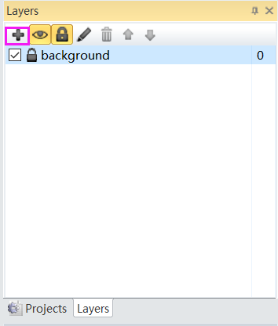

随后我们就要插入游戏对象了，在背景上点击右键，然后选择插入新的对象,再双击sprite即可,点击之后，图标会变成十字形，在背景上单击后，会弹出上面的那个带有绿色框框的弹窗，仍然是点击那个绿色框框里的图标，然后选择自己喜欢的图片作为游戏形象。

单击背景上的游戏对象，我们可以对该游戏对象进行编辑，现在我们看向左边的一栏

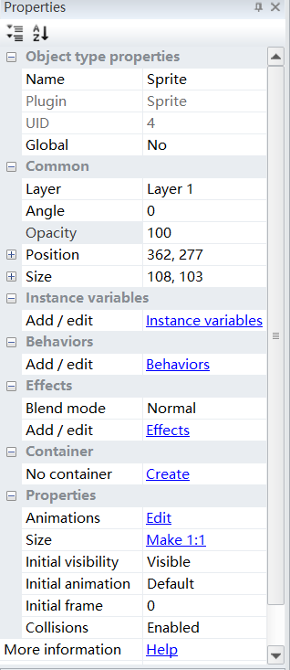

name可以编辑它的名字，layer可以决定它处于那个图层，angle决定它面对的方向，对象开始是对着正右侧的，提醒注意的是角度是顺时针算的，opacity决定透明度，其为100时表示完全不透明，position与size上面讲过。

我们可以对游戏形象添加行为，点击Behaviors即可，在这里我们简单介绍几种行为：

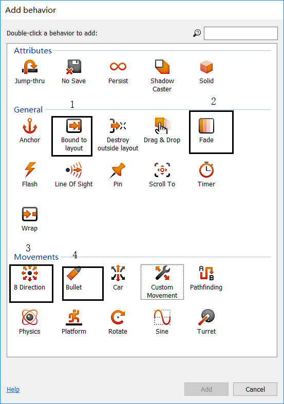

>1号：可保证对象不会走到背景外  
2号：表示对象消失  
3号：表示对象可以朝着八个方向移动  
4号：表示对象会向着它面朝的方向移动

这样我们就可以为背景上的对象添加行为了

如下图是4号的演示：

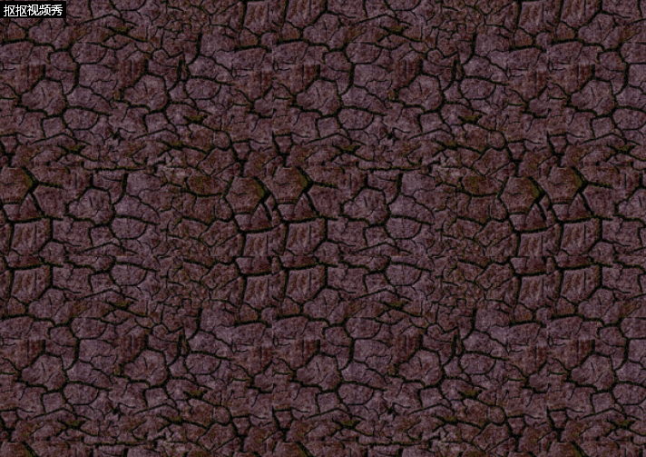

# 5.添加活动

活动和行为的区别在于，行为是对象一定会发生的，而活动不同，活动需要满足某种条件才会发生。

在这里简单举两个例子：

## 1.让对象始终面对光标所在的位置

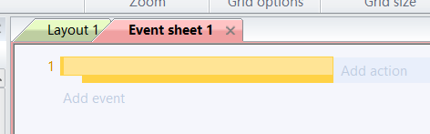

add event 即添加事件（也可理解为条件），add action即添加行为，我们点击add event，然后选择system,在其中选择 every tick，这样我们就完成了add event，随后我们选择add action 选择你要选择的游戏对象，再选择 set angle toward position,选择后弹出以下窗口。

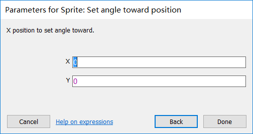

在两栏中分别填入Mouse.X和Mouse.Y

对象就会一直面对光标了

## 2.通过单击鼠标左键让A对象发射B对象

首先我们要双击布局中的空白处以插入新对象。出现“ 插入新对象”对话框后，双击鼠标，这样我们就添加了鼠标这个对象（否则我们会在add event时找不到鼠标这个选项）。

添加好以后，我们add event选择鼠标

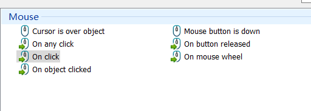

随后点击 on click

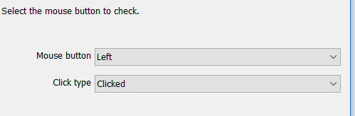

然后选择 左键 单击

add event之后我们add action，选择你的A对象然后选择 spawn another object 再选择B对象，这样便大功告成了。

