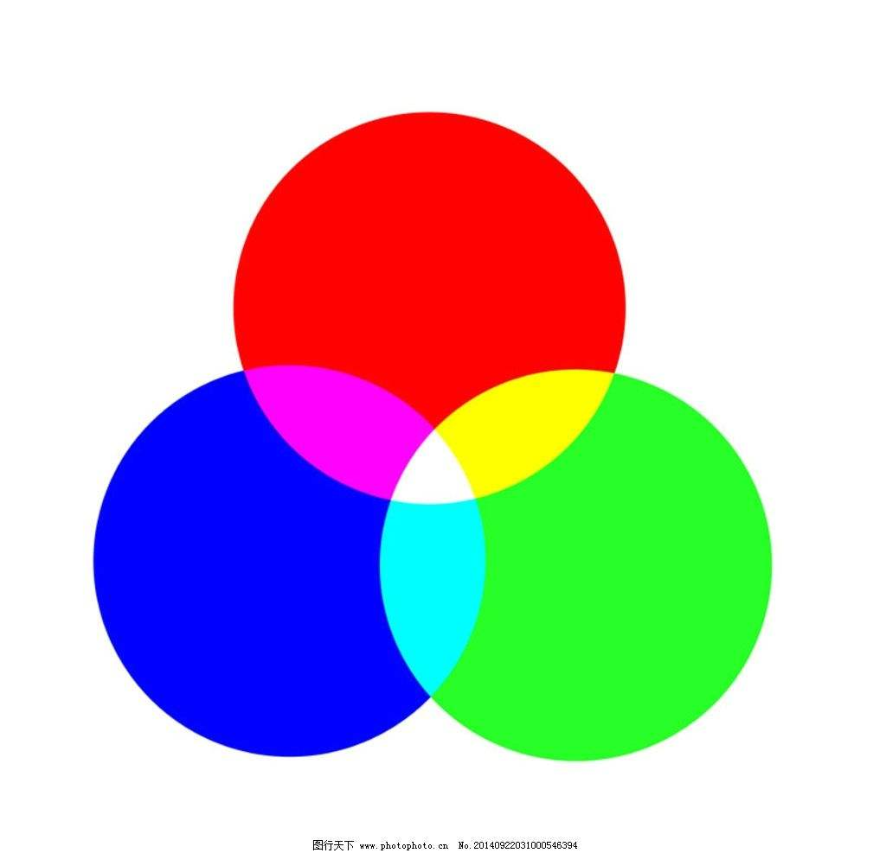
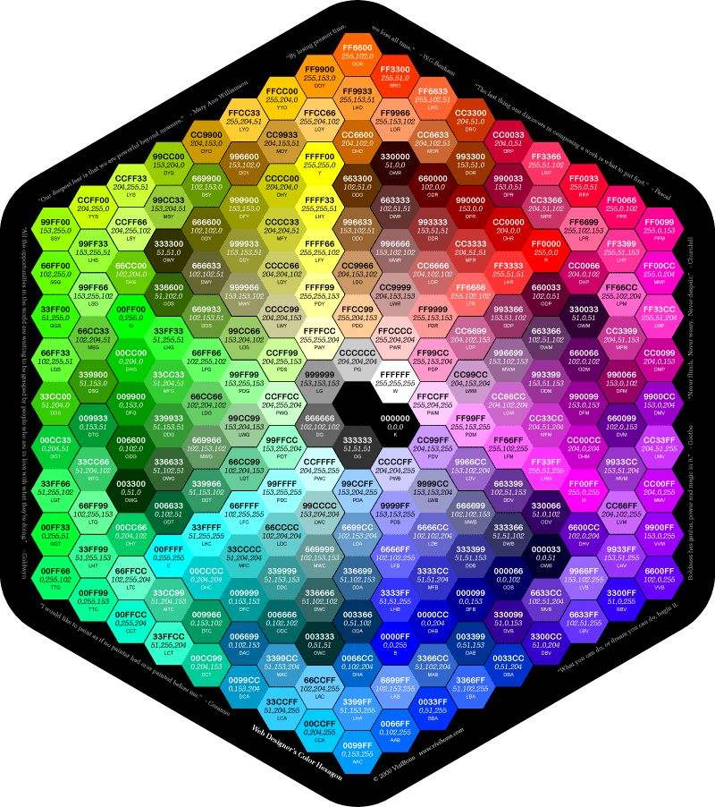

# 色彩表示与编码

  色彩是生活中司空见惯的事物，在计算机中图片也都带有色彩，那么如何在计算机的世界里如何表示色彩呢？我们在此简单讨论一下这个问题。

## 色彩的形成

首先我们来谈谈色彩的形成，从人眼的角度来讲的话，颜色其实就是不同的光对我们的视网膜的不同影响，这样讲可能还是有些抽象，我们从视网膜的情况讲起。

在我们的视网膜中，有三层特殊的细胞，它们可以感受三种不同的颜色，分别是红色，绿色，蓝色，也就是人们常讲的三原色，如下图所示。

人眼通过感受这三种颜色的强弱来混合出特定的颜色。

在计算机中我们也采取了类似的方式来表示和存储颜色。

## 计算机中颜色的表示

因为计算机只认识0和1，所以我们不得不想办法用零和一来表示颜色。

类似人眼，我们用三原色来表示一个特定的颜色，这样我们只需表示三原色的强弱就可以，所以每个颜色都有一个特定的RGB，RGB是用来表示三原色的强弱的，如下图，显示了不同的颜色所对应的RGB。

（图片放大后可以看出每个颜色对应的RGB）

大家可能已经发现了表示三原色深度的数最小为0最大为255，这是何原因呢，我们接下来看下面的解释。

说到底我们要用零和一来表示三原色，现在有两种常见的表示方式。

 * HiColcr

 这种方式是用16个二进制位来表示颜色，在这之中三原色中每个颜色占5个二进制位，也就是说三原色中每个颜色深度的范围为0到31。这是我们发现还多出了一个二进制位，这个二进制位用来表示这个颜色的透明度，这就是HiColor表示颜色的方式。

  * TrueColor

  在这种方式中，我们用24个二进制位来表示颜色，也就是三原色中的每个颜色占用8个二进制位，大家可以自己算出，三原色中每个颜色的深度范围为0到255（我们上面的RGB图也就是用的TureColor方式）。这个方式也是目前最常用的颜色表示方式。

  除这两种表示方式外，还有其他的表示方式，比如占用二进制位更多的方式，它们用来满足一些特定职业者如画家、设计者对颜色的极端追求，在此不再过多介绍。