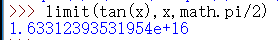
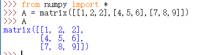
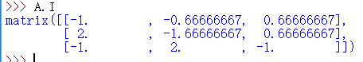
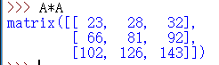

# 用 Python 做数学题

## 一、用python解决高数题

### 1.求 1/(2+sinx) 的不定积分

在python中先加载sympy中的所有函数

  

随后定义变量x  

 

然后用integrate函数求不定积分

我们得到的结果

 

就是最后的答案了

其中sqrt表示开方，atan表示arctan，pi即圆周率

floor为[ x ] 即不超过x的最大整数

### 2.求 tanx x取二分之pi时的极限

在已加载sympy中的所有函数的基础上，我们实用limit函数求极限

我们可以看到结果是一个极大的正数，这便是我们要求的极限

## 二、用python解决线代题

### 1.求矩阵的逆

矩阵的逆意义重大，而手算矩阵的逆极其繁琐，我们利用python来求矩阵的逆

首先还是加载一个库中的所有函数，这里我们选择numpy

随后我们将A定义为一个矩阵

我们用函数.I求矩阵的逆

这样我们就求出了该矩阵的逆

### 2.求矩阵相乘的结果

这里我们选择采取最暴力的方式直接A*A

但即使如此我们还是轻松的得到了我们想要的结果

